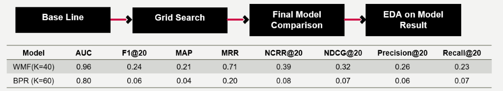

# song-recommender-system

This is the final group project for CS608 Recommender Systems module at Singapore Management University for my Master of IT in Business program. The team members contributing to the project included:
- Zhou Yijun
- Liu Cuiyi
- Heng Chang Boon
- Zhang Yuhao

 Song recommendation was the subject of study in our group project. Using implicit ratings consisting of user ID, song ID and play count, we built a song recommender system with Weighted Matrix Factorization and provided explanations for the recommendation using both latent factors and additional song acoustic features. In dealing with the cold-start problem, we allowed the new user to either specify his/her artist preference or music acoustic preference, and recommended songs based on his/her nearest neighbours in the existing user base.

 ## Collecting and Processing Data
 The majority of the dataset used was collected from the Million Song Dataset, which is a freely available collection of audio features and metadata for a million popular music tracks. Triplets were used to train and test WMF and BPR models. Spotify Audio Features were used to provide explanations and, in the cold-start scenario, find nearest neighbours of a new user. Metadata was used to link triplets and other datasets. Metadata, artist term, and genres were utilized in the attempt to either build a contextual model or provide explanations for recommendation. Finally, lyrics data was proposed to add the textual modality on top of the existing model, but this was not explored due to limited time and resources.  

The implicit rating data consisted of triplets of user ID, song ID and play count as highlighted by the red box in Figure 1.  The raw dataset contained 48,373,586 entries in which there were 

1,019,318 unique users and 384,546 unique songs. There were two main issues with this dataset: The data size was too large to train and tune given limited time and resources, therefore needed to be sampled. In addition, the data had a high percentage of low and extremely high play counts which should be treated as noise or outliers. For example, a user might be on shuffle mode and a song was played for 5 seconds before it was skipped. An extremely high play count, for example, 3000, could be because a fixed playlist was played every day at some store as the background music.  

As shown in Figure 2, we processed data by filtering the play count by a range (2 to 150), inner-merging triplets and metadata to ensure that we had acoustic features for all songs filtered, and filtering the songs which have at least been rated by 50 users and users who have listened to at least 20 songs. At the end of the data processing, the triplet data size was reduced to 2% of the raw data size.  

## Building Model and Provide Explanation
We trained and tuned two models, namely Weighted Matrix Factorization (WMF) and Bayesian Probabilistic Ranking (BPR). The processed triplets were split into train and test at a test ratio of 0.33 with a stratified manner (by user ID).  Figure 3 showed that WMF model outperformed BPR. The recall@20 indicated that this model gave reasonably well recommendation. Since the focus of this project was not to merely achieve best evaluation metrics, the tuned WMF model was used in building the end-to-end recommender system.  

While examining the recommendation made by WMF model, we discovered that it tended to recommend songs with high popularity as the number of latent factors increased (Figure 4) and, therefore, lacked the novelty and surprise factor. In order to resolve this issue, we proposed to remove songs whose popularity exceeded a predefined threshold (for example, 200) from the recommendation. In the song recommender’s user interface, users should also be given the option to exclude his familiar artists and songs for novel discoveries.   

In order to interpret the WMF recommendation, we performed Principal Component Analysis on its latent factors and match PC1 and PC2 to metadata such as genres (Figure 5). A particular song’s nearest neighbours were also visualized in 3-D space (top 3 PCs, Figure 6).  The clustering is heavily linked to song genres, which was expected before the analysis. 

Besides triplet dataset, we would like to make use of song metadata such as acoustic features in model building and providing explanations. We used libFM implementation of Factorization Machine model along with different contextual data, as shown in Table 1 and Figure 7. In particular, metadata and Spotify audio features were given as numeric values. Artist terms were encoded as one-hot vectors. For lyrics data, the top 5000 words were used as one-hot vectors. The results showed the best contextual model (triplets + artist terms) only improved the ranking metrics by a small amount. As a result, we decided not to deploy the contextual model in the end-to-end system. However, we explored user clustering by acoustic features in the next section, for both explanation and cold-start problem.  

## Acoustic Features for Recommendation and Explanation
Each song has a list of acoustic features in numeric values such as danceability, energy, and speechiness. They were normalized to the scale between 0 to 1 to be displayed on a radar map. An existing user’s acoustic preference was derived from the average acoustic features of his top 20 played songs. We compared this user acoustic preference with acoustic features of the songs recommended by the WMF model (Figure 8). As shown, the recommended songs had acoustic features that the user preferred, for example, high loudness, energy and danceability. This provided a good explanation. 

In addition to providing explanations, acoustic features were used to provide recommendation for a new user. A new user can either specify artist preference, from which we derived his acoustic preference using top songs of the selected artists, or directly specify the numeric values of his acoustic preference (as shown in Figure 9). This acoustic preference was used to find the top 5 nearest neighbours in the existing user base. The recommendation was the average of recommendation made for these 5 neighbours by the WMF model. 

## Building an End-to-End Recommender System
Building an end-to-end recommender system did not end at model training and explanations. Designing a user interface by considering user behaviours was also an important component. Therefore, we also dedicated time and effort to designing the UI and understanding the user interaction with the recommender system. Refer to the Appendix or the “demo” Jupyter Notebook for the UI. It was also worth mentioning that the data collection had to be incorporated into the recommender system to continuously gather user data to improve the recommendation accuracy and cater to the change of user preference.  

Song recommendation came with its particularities. For example, recommendation of the same music (a user’s all-time favourite song, for example) at a later point in time, may be appreciated. Repeated recommendation or novel recommendation is a matter of user’s preference, and should be left for users to decide. Therefore, when we designed the UI, we placed a user’s top songs, artists and genres at the top, and gave him the option to explore novel songs at his own pace. This was much preferred than recommending new songs without his asking.  

As for future works, a content-based algorithm could be used to handle the cold-start problem using user profile such as age, gender, and language. This information would be available in commercial music apps. Besides recommending single songs, we could also recommend playlists as the ensemble of songs and direct song-to-song transitions matter in user’s listening experience. 